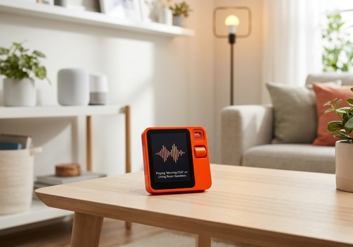

# Rabbit R1 - Homey Integration

A powerful integration that brings Homey Pro smart home control to the Rabbit R1 device via the Creation SDK.

## Overview
This project enables seamless voice control of your Homey Pro smart home using the Rabbit R1. It utilizes the Rabbit R1 Creation SDK to provide a native-feeling experience with a circular UI optimized for the R1 display.

## Key Features
- **Voice Control**: Send natural language commands to Homey Pro directly from your R1.
- **Native R1 UX**: A beautiful, circular chat interface designed specifically for the R1's 240x282 display.
- **Bi-directional Feedback**: Receive text and voice (TTS) responses from Homey on your R1.
- **Global Mobility**: Works anywhere (WiFi or Cellular) using Athom's secure cloud connection.
- **Premium UI**: Smooth scrolling animations, typewriter effects, and dynamic status indicators.

## Architecture
The system is composed of two main components:
1. **Homey App**: Runs on your Homey Pro, exposing a secure API to receive commands and trigger Flows.
2. **Rabbit R1 Creation**: A specialized web application (served by Homey) that handles hardware events (PTT button), voice recognition, and UI rendering on the R1.

## Installation & Setup

### 1. Install the Homey App
- Install the `com.dimapp.rabbitr1` app on your Homey Pro.
- Open the App Settings in the Homey mobile app or via `my.homey.app`.

### 2. Install the Creation on R1
- In the Homey settings page, you will see the **Installation QR Code**.
- On your Rabbit R1, enter **Creations** mode.
- Scan the QR code to install the "Homey Control" app on your R1.

### 3. Secure Pairing
- Open the "Homey Control" app on your R1.
- In the Homey settings page, locate the **Configuration QR Code**.
- Click "Scan QR Code" on your R1 and scan this second code to securely pair the devices.

## Usage
- **PTT Button**: Hold the side button to speak. Release to send the command to Homey.
- **Voice Feedback**: Homey will confirm actions through the R1 speaker.
- **Visual History**: Follow your conversation in the chat-like interface.

## Development
The R1 assets are located in `assets/r1/`:
- `index.html`: UI Layout.
- `js/app.js`: Interaction logic, hardware events (`longPressStart`, `longPressEnd`, `sideClick`), and API communication.
- `js/tts.js`: Integration with Rabbit's native Text-to-Speech.
- `css/styles.css`: Visual styling for the circular display.

The Homey backend logic:
- `app.js`: App lifecycle and Flow card triggers.
- `api.js`: REST API endpoints for receiving commands from R1.

## License
This project is licensed under the GNU General Public License v3.0 - see the [LICENSE](LICENSE) file for details.

---
Developed with ❤️ for the Homey & Rabbit communities.
